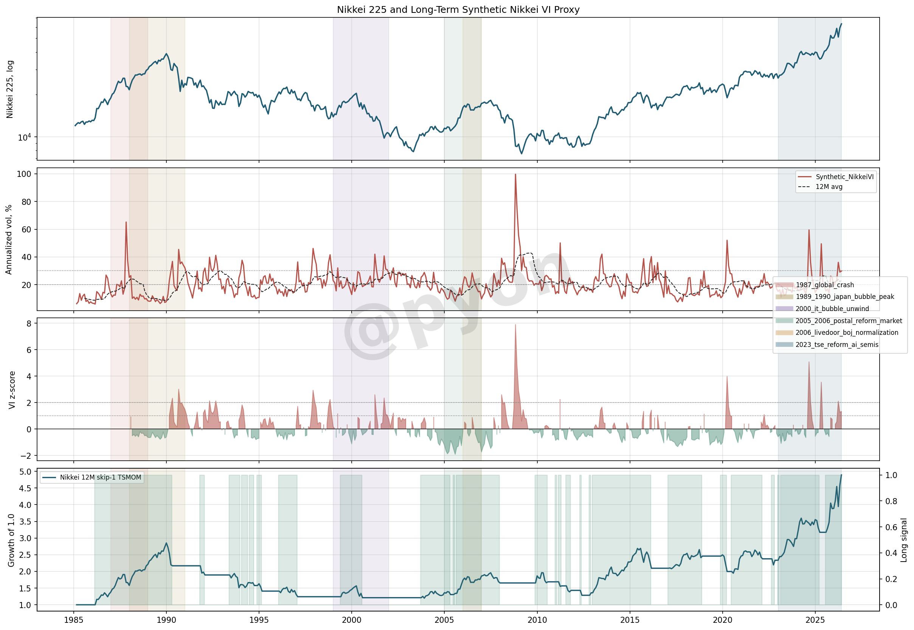
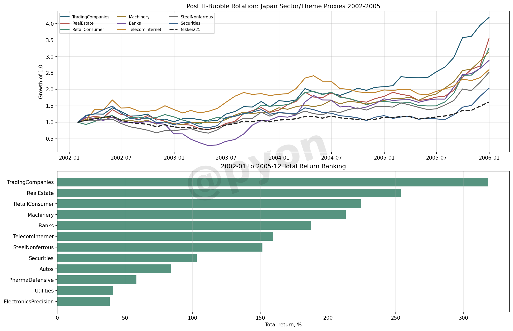
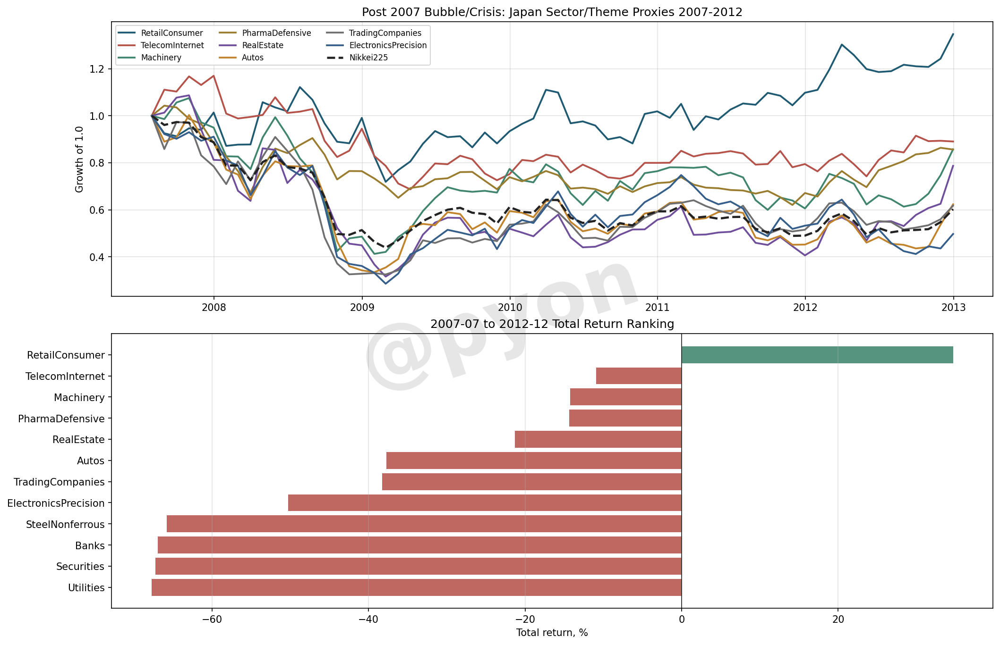
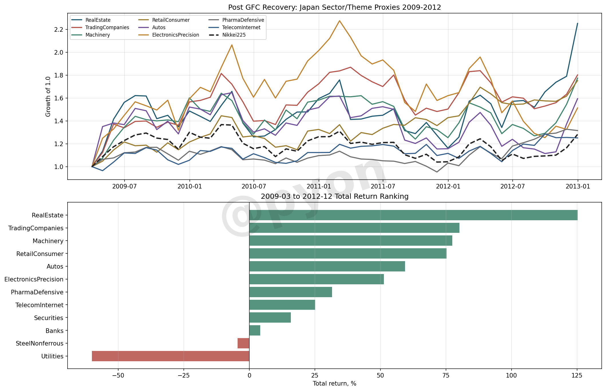

# 日本株は本当に「モメンタムが効かない市場」なのか

## 要旨

日本株は長く「モメンタムが効きにくい例外市場」と言われてきた。

しかし、2023年以降の日本株を見ると、東証改革、円安、半導体、AI、海外投資家フローが重なり、強いモメンタム相場が観測されている。

本稿の結論は次の通り。

> 日本株はモメンタムが存在しない市場ではない。  
> 広範なクロスセクションでは弱いが、トレンド、ボラティリティ、政策、テーマ、外部資金フローが揃うとモメンタムが強く出る条件付き市場である。

## 1. モメンタムを分けて考える

日本株のモメンタムを議論するとき、少なくとも2つを分ける必要がある。

- Time-Series Momentum: 指数自身の過去リターンが正ならロング
- Cross-Sectional Momentum: 同じ市場内で強い銘柄を買い、弱い銘柄を売る

過去の「日本はモメンタム例外」という議論は、主に広範なCross-Sectional Momentumの弱さを指している。

一方、2023年以降に強く見えるのは、指数のTime-Series Momentumと、半導体・AI・改革・円安テーマ内のMomentumである。

## 2. 長期仮想VIで見る日本株

公式の日経VIがない期間を比較するため、日経平均の日次リターンから仮想VIを作った。

これは公式の日経VIではない。市場ストレスを同じ尺度で見るための実現ボラティリティproxyである。



重要なのは、日本株のモメンタムが低ボラだけで出るわけではない点だ。

1987年後や2023年以降のように、高ボラでも上昇ショックが続くと、モメンタムは機能する。

逆に2000年ITバブル崩壊期のように、高ボラ化しながら指数が下落トレンドへ転じると、モメンタムは攻めではなく防御寄りになる。

## 3. ITバブル崩壊後の受け皿

2002-2005年を見ると、次の受け皿はIT/電機の延長ではなかった。

強かったのは、商社、不動産、小売/消費、機械、銀行、鉄鋼・非鉄などだった。



つまり、バブル崩壊後の次のモメンタムは、前の主役からではなく、景気回復、リフレ、バランスシート修復、資本財、内需再評価から生まれやすい。

## 4. 2007年以降との比較

2007-2012年の金融危機込みでは、ほぼ全面的に厳しい。

相対的に強かったのは小売/消費、通信/ネット、医薬など。銀行、証券、不動産、鉄鋼・非鉄は大きく崩れた。



一方、2009-2012年の底打ち後を見ると、不動産、商社、機械、小売/消費、自動車、電機精密が戻った。



崩壊中と底打ち後では、資金の受け皿が違う。

## 5. 今の日本株は何型か

今の日本株は、低ボラ順張り相場というより、高ボラ上昇モメンタム相場に近い。

ボラが低いから上がるのではなく、円安、半導体、海外勢、東証改革が重なり、ボラを伴いながら上方向にトレンドが出ている。

見るべき分岐点は次の5つ。

- 日経平均・TOPIXの12か月モメンタムが維持されるか
- 仮想VIが高止まりしながら下落局面で上がる形になるか
- 半導体・AIインフラの相対モメンタムが崩れるか
- 円安トレンドが止まるか
- 海外投資家フローが反転するか

## 6. 過去もモメンタムが先導したのか

ここでいうモメンタムには2種類ある。

1つは、学術的なファクター投資におけるMomentum。

もう1つは、SNSでよく言われる「強いテーマを買えば翌日も上がる」という短期テーマ追随型のモメンタムである。

後者をあえて雑に言えば、チンパンモメンタムである。

両者は同じではない。だが、完全に無関係でもない。

チンパンモメンタムを分解すると、多くの場合、

- 過去リターンの強い銘柄
- 流動性の大きいテーマ株
- 指数寄与度の大きい大型株
- 出来高やニュースで注目された銘柄
- 海外勢やCTAのバスケット買い

へ資金が集中している。

これは、学術的WMLそのものではないが、構造的には `long-only momentum` と指数構造の合成に近い。

特に日経225は価格加重型に近いため、値がさ株や半導体のモメンタムが指数全体のモメンタムとして見えやすい。

### 1987-1989: 信用拡張・資産価格モメンタム

1987年クラッシュ後から1989年バブル天井までは、テーマ株というより、信用拡張と資産価格上昇そのものがモメンタム化した局面だった。

仮想VIベースでは、1987年後のイベント窓で日経平均は `+50%`、12か月モメンタム戦略は `+60%` 程度となった。

ただし、Yahoo Financeで取得できる日本個別株の履歴は1987-1989まで十分に遡れなかったため、この期間のセクターproxy実証は限定的である。

### 1999-2000: IT/ネット・テーマ株モメンタム

ITバブル期は、かなり典型的なテーマ株モメンタムだった。

通信、ネット、ITサービス、電機、半導体、新興市場に資金が集中した。

しかし崩壊後の2002-2005を見ると、次に伸びたのはIT/電機ではなかった。

代表銘柄proxyでは、2002-2005年に強かったのは、

- 商社: `+318%`
- 不動産: `+254%`
- 小売/消費: `+225%`
- 機械: `+213%`
- 銀行: `+188%`
- 鉄鋼・非鉄: `+152%`

だった。

つまり、ITバブル期はモメンタムが先導したが、崩壊後の受け皿は全く別の領域へ移った。

### 2005-2006: 改革・内需・金融モメンタム

郵政相場は、低〜中ボラで政策テーマに資金が集中した局面だった。

ここでは、改革期待、金融正常化、内需、不動産、証券、銀行、小型株がモメンタム化しやすかった。

イベント表では、2005-2006年の日経平均は `+51%`、12か月モメンタム戦略は `+37%` 程度だった。

これは、現在のAI/半導体モメンタムとは異なり、より内需・金融・資産価格寄りのモメンタムだった。

### 2007-2012: 崩壊中は防御、底打ち後はリフレ受け皿

2007-2012年の金融危機込みでは、ほぼ全面的に厳しい。

相対的に強かったのは小売/消費で `+35%`。通信/ネット、機械、医薬はマイナスだが相対的には持ちこたえた。

一方で、銀行、証券、公益、鉄鋼・非鉄は大きく崩れた。

しかし2009-2012年の底打ち後だけを見ると、受け皿は変わった。

- 不動産: `+125%`
- 商社: `+80%`
- 機械: `+77%`
- 小売/消費: `+75%`
- 自動車: `+59%`
- 電機精密: `+51%`

これは、危機後のリバーサルが、その後に景気回復モメンタムへ変わるパターンである。

### 2023年以降: 高ボラ上昇モメンタム

2023年以降は、

- 半導体
- AIインフラ
- 電線
- 重工/防衛
- 商社
- 円安外需
- 東証改革/低PBR
- 日経225寄与度上位

が重なった。

これは、テーマモメンタム、指数寄与度モメンタム、海外勢バスケット買い、円安、CTA的トレンドの合成である。

したがって、過去もモメンタムは先導していた可能性が高い。

ただし、時代ごとにモメンタムを生む主役と伝播経路が違う。

```text
1987-1989
信用拡張・資産価格モメンタム

1999-2000
IT/ネット・テーマ株モメンタム

2005-2006
改革・内需・金融・小型株モメンタム

2009-2012
危機後リバーサルからの景気回復モメンタム

2023-
半導体・AI・円安・指数寄与度・海外勢モメンタム
```

## 結論

日本株は「モメンタムが効かない市場」ではない。

より正確には、

> 日本株は、条件が揃うと急にモメンタム市場になる。

その条件とは、トレンド、ボラティリティ、政策、テーマ、海外資金フローの組み合わせである。

## 注意

本稿は研究メモであり、投資助言ではない。

`Synthetic_NikkeiVI` は公式の日経VIではなく、日経平均の実現ボラティリティから作ったproxyである。

セクター分析は代表銘柄バスケットによるproxyであり、公式TOPIX業種指数ではない。
